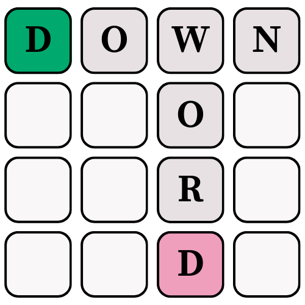

# Downword

A word puzzle game where players create connected words while navigating from start to finish.

## How to Play
- Connect letters to form valid words
- Words can be formed horizontally or vertically
- Navigate from the start position to the goal
- All connected letters must be part of valid words

## Play Now
[Play Downword](https://thsnyder.github.io/downword/)
